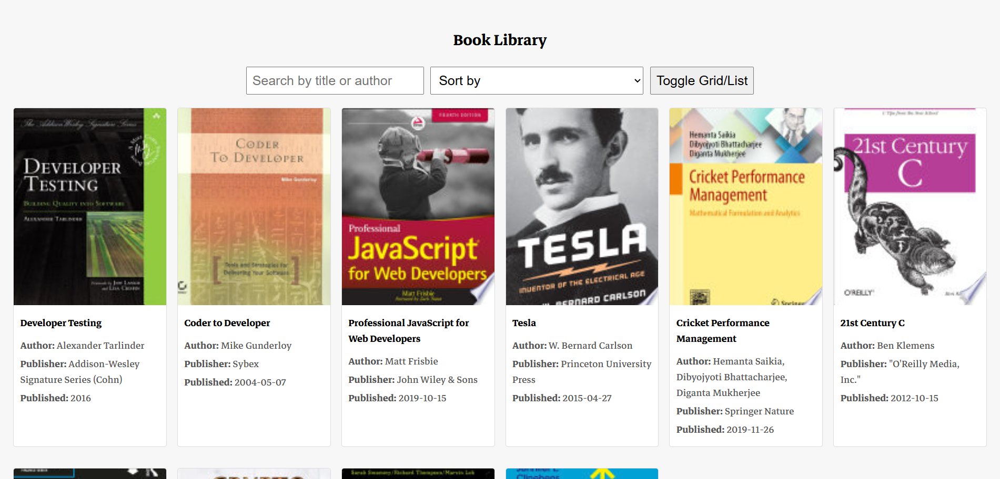

# Book Library

## Overview

A simple library-style web page that fetches and displays books from the FreeAPI Books endpoint.

## Features

- **Book Fetching** – Retrieve and display a list of books from FreeAPI.
- **Book Display** – Show book thumbnails, titles, authors, publisher, and published date.
- **Clickable Books** – Clicking on a book’s card opens its info link in a new tab (if available).
- **Search Functionality** – Users can filter books dynamically on the frontend by title or author.
- **Sorting** – Sort books alphabetically by title or by published date.
- **Toggle View** – Switch between grid and list layouts.
- **Pagination / Infinite Scrolling** – As users scroll, the next page of data is fetched and displayed.

## Tech Stack

- **Frontend**: HTML, CSS, JavaScript
- **API**: FreeAPI

## Deployment Link

- Link : https://chaicode-masterji-book-library.vercel.app/
